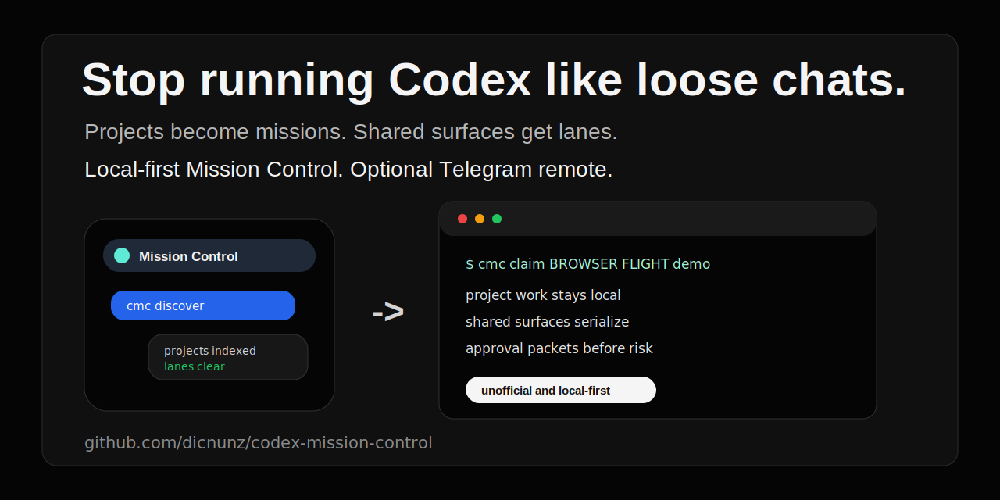
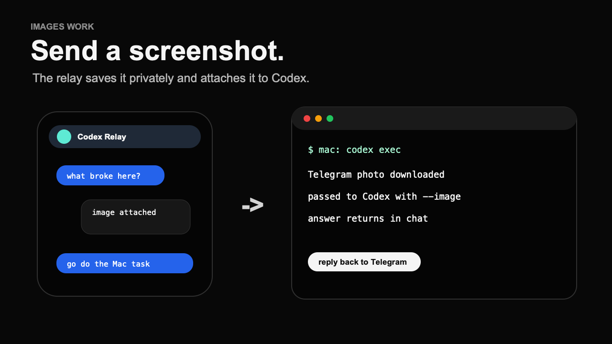
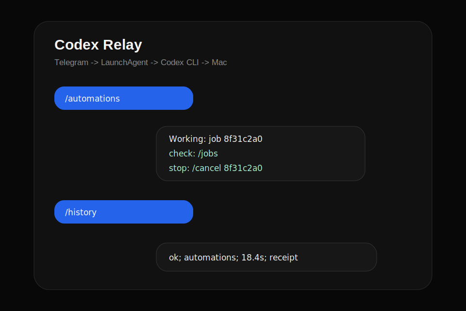

# Codex Relay

Telegram remote for Codex on your Mac.

<p align="center">
  
</p>

Text your bot from anywhere. Your Mac runs the real Codex CLI locally and replies in Telegram when the job is done.

That is the whole product: Telegram is the remote, Codex is the engine, your Mac is the computer doing the work.

> Unofficial project. Not affiliated with OpenAI or Telegram.

## Demo Story

[Watch the demo](assets/codex-relay-demo.mp4)

<p align="center">
  
</p>

```text
/alive
/tools
send a screenshot and ask what changed
/cd Projects/my-repo
make this repo launch-ready without pushing
```

The demo should make one thing obvious: Telegram is only the remote. The real work happens on the Mac through your installed Codex CLI, in the folder and sandbox you configured.

<p align="center">
  
</p>

## How It Feels

Codex Relay is useful for tasks that are worth waiting for:

- Check a repo while you are away from the laptop.
- Send a screenshot and ask what changed.
- Run a small fix, test, or doc pass in a known folder.
- Ask Codex to inspect local files, apps, or browser state when your Codex runtime exposes those tools.

It is not instant chat. A `/ping` is immediate, but a normal request waits for Codex CLI startup, model time, local tool work, and Telegram delivery. Small text tasks can feel quick; image, browser, Computer Use, repo, or test-running tasks can take tens of seconds or minutes. The default task timeout is 600 seconds.

## What Works

- `gpt-5.5` with `xhigh` reasoning by default through the Codex app CLI.
- Private Telegram bot allow-listed to your Telegram user.
- Named Codex threads: `/new`, `/use`, `/list`, `/reset`.
- Per-thread folders: `/cd`, `/where`, `/home`.
- Telegram photos and image documents passed to Codex with `--image`.
- Mac-side files, repos, shell, Computer Use, Browser Use, apps, and subagents when your local Codex runtime exposes them.
- macOS LaunchAgent so the relay stays running after setup.
- Local config only. No hosted relay account.

## Install

Requirements:

- macOS
- Codex Mac app installed and signed in
- Telegram account

```bash
git clone https://github.com/dicnunz/codex-relay.git
cd codex-relay
./scripts/install.sh
```

The installer:

1. Finds the Codex app CLI.
2. Asks for your Telegram bot token.
3. Verifies the bot with Telegram.
4. Waits for you to send `/start`.
5. Allow-lists your Telegram user.
6. Installs and starts the LaunchAgent.

The only manual credential step is creating a bot with `@BotFather` and pasting its token.

After install, DM your bot:

```text
/alive
/tools
/new repo
/cd Projects/my-repo
read this repo and tell me the next best fix
```

## Commands

```text
/alive        live route, model, folder, uptime
/status       current thread and runtime config
/tools        quick Codex tool probe
/try          useful first prompts
/new name     new Codex thread
/use name     switch threads
/list         list threads
/where        show active folder
/cd path      set active folder
/home         set folder to ~
/reset        clear the current Codex session
/ping         bridge check
```

Normal messages go to the active thread. Captions on Telegram images become the prompt; image files are saved privately and attached to Codex.

## Message Style

By default, Codex Relay sends clean Telegram messages instead of explicit reply bubbles quoting your last message. Turn threaded replies back on only if you want that chat style:

```env
CODEX_TELEGRAM_REPLY_TO_MESSAGES=true
```

Normal messages use `CODEX_TELEGRAM_MODEL=gpt-5.5` and `CODEX_TELEGRAM_REASONING_EFFORT=xhigh`. Change that env var only if you intentionally want a different reasoning profile.

`/status` shows the active reasoning setting, last run status, and latency after Codex replies.

## Verify

```bash
./scripts/doctor.sh
./scripts/status.sh
```

Runtime files:

```text
~/Library/Application Support/CodexRelay
~/Library/LaunchAgents/com.codexrelay.agent.plist
```

## Safety

Codex Relay is intentionally powerful. If you expose your Telegram bot, you are exposing a path to Codex on your Mac.

- `.env` is private and gitignored.
- Runtime config is copied with `0600` permissions.
- Only the allow-listed Telegram user/chat can run Codex.
- Images are stored in the private runtime state directory and pruned by retention settings.
- High-risk actions can still hit Codex/OpenAI/macOS confirmations.
- It cannot bypass logins, MFA, macOS privacy prompts, site safety barriers, account limits, or mandatory confirmations.

Use it only with a Telegram account and Mac you trust.

## Honest Limits

- It uses your normal Codex/OpenAI account limits.
- It does not mirror the visible Codex desktop chat UI.
- It waits for Codex to finish before sending the final answer.
- It is not a generic agent platform.
- Computer Use and plugin behavior depend on what your local Codex runtime exposes.
- The bot will feel as capable as the Codex install on that Mac, not more.

## Why This Exists

Codex is already useful on a Mac. Codex Relay just makes it reachable from the chat app already on your phone.

Small surface. Local runtime. Real Codex.
